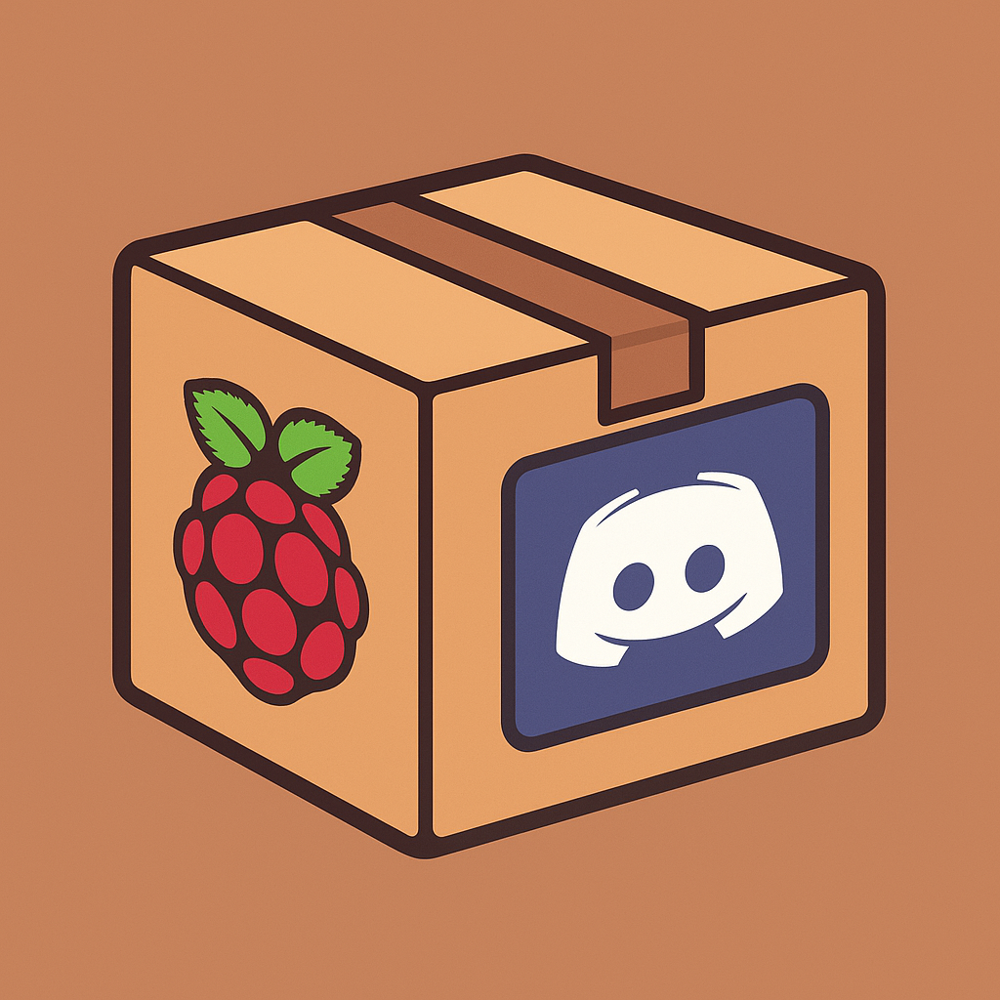

# PackageBot 🤖

A D## 🛠️ Built With

- **Python** - Programming language
- **discord.py** - Discord API wrapper
- **python-dotenv** - Environment variable management

## 📋 Project Status

This is a personal learning project - feel free to look at the code and learn from it!d bot built with Python and discord.py - my student project for learning bot development!

## ✨ About This Project

This is a student project where I'm learning how to create Discord bots using Python. It's a work in progress and I'll be adding more features as I learn!

## 🎮 Current Commands

| Command | Description | Usage |
|---------|-------------|--------|
| `!hello` | Greets the user | `!hello` |
| `!ping` | Shows bot latency | `!ping` |
| `!info` | Displays bot information | `!info` |
| `!say` | Makes the bot repeat a message | `!say Hello World!` |
| `!help` | Shows all available commands | `!help` |

## �️ Built With

- **Python** - Programming language
- **discord.py** - Discord API wrapper
- **python-dotenv** - Environment variable management

## 📚 What I'm Learning

- Discord bot development
- Python async programming
- API interactions
- Environment configuration
- Git and version control

## � Future Plans

*Space for my future ideas and features I want to add...*

## � Project Notes

*Space for documenting my learning process and challenges...*

## 🤝 Resources I'm Using

- [Discord.py Documentation](https://discordpy.readthedocs.io/)
- [Discord Developer Portal](https://discord.com/developers/applications)
- [Python Documentation](https://docs.python.org/)

---

*Student project - Fall 2025*